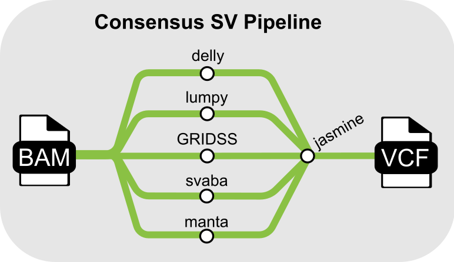

# Consensus Structural Variant Caller (Waise et al., 2025)

This repository contains a Nextflow implementation of the consensus structural variant (SV) pipeline presented by Waise et al. (2025) _bioRxiv_.



## Installation

Install Nextflow from [https://www.nextflow.io/](https://www.nextflow.io/).

Install [Docker](https://docs.docker.com/get-started/get-docker/) or [Singularity](https://docs.sylabs.io/guides/latest/user-guide/quick_start.html) on your system.

Clone the pipeline from github to your local working directory:

```bash
git clone https://github.com/sarawaise/NASA-SV.git
cd NASA-SV
```

## Quickstart

The pipeline requires a `samplesheet.csv` file listing tumor-normal BAM file pairs and their index files:

```
id,tumor_bam,tumor_bai,normal_bam,normal_bai
nasa1,t1.bam,t1.bam.bai,n1.bam,n1.bam.bai
nasa2,t2.bam,t1.bam.bai,n2.bam,n1.bam.bai
nasa3,t3.bam,t1.bam.bai,n3.bam,n1.bam.bai
```

> [!NOTE]
> BAM index files are required for Nextflow to include them in the working directory.

In addition, an indexed reference FASTA must be provided. The indexes should be created with SAMtools and BWA for use by the various callers:

```bash
samtools faidx genome.fasta
bwa index genome.fasta
```

An archive file (10GB) with test BAM files and an indexed hg38 reference is [available on Zenodo (ID:15226469)](https://zenodo.org/records/15226469). To test the pipeline, extract the data archive and run:

```bash
nextflow run main.nf -profile singularity --csv test.csv -c nextflow.config
```

## Credits

The Genomics England implementation used for Waise et al., 2025 was written by Alex Cornish and Sara Waise. The Nextflow implementation provided in this repository was written by Nana Mensah and Sara Waise.

## License

This project is licensed under the MIT License - see the [LICENSE](LICENSE) file for details.